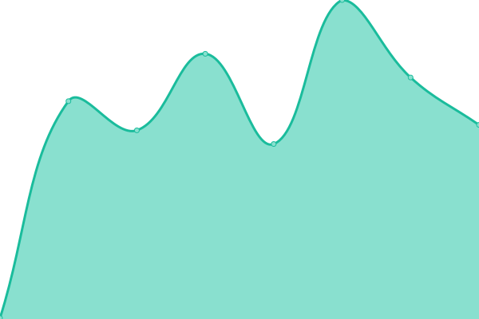

# [📈 Live Status](https://CDMorpheus.github.io/cyber-dive-upptime): <!--live status--> **🟧 Partial outage**

This repository contains the open-source uptime monitor and status page for [CDMorpheus](https://CDMorpheus.github.io/cyber-dive-upptime), powered by [Upptime](https://github.com/upptime/upptime).

With [Upptime](https://upptime.js.org), you can get your own unlimited and free uptime monitor and status page, powered entirely by a GitHub repository. We use [Issues](https://github.com/CDMorpheus/cyber-dive-upptime/issues) as incident reports, [Actions](https://github.com/CDMorpheus/cyber-dive-upptime/actions) as uptime monitors, and [Pages](https://CDMorpheus.github.io/cyber-dive-upptime) for the status page.

<!--start: status pages-->
<!-- This summary is generated by Upptime (https://github.com/upptime/upptime) -->
<!-- Do not edit this manually, your changes will be overwritten -->
<!-- prettier-ignore -->
| URL | Status | History | Response Time | Uptime |
| --- | ------ | ------- | ------------- | ------ |
|  [Main Website](https://www.cyberdive.co) | 🟩 Up | [main-website.yml](https://github.com/CDMorpheus/cyber-dive-upptime/commits/HEAD/history/main-website.yml) | 

 1031ms
     
 | 

<a href="https://CDMorpheus.github.io/cyber-dive-upptime/history/main-website">46.48%</a>
    

|  [App Login](https://app.cyberdive.co) | 🟩 Up | [app-login.yml](https://github.com/CDMorpheus/cyber-dive-upptime/commits/HEAD/history/app-login.yml) | 

 271ms
     
 | 

<a href="https://CDMorpheus.github.io/cyber-dive-upptime/history/app-login">100.00%</a>
    

|  [Parenting - Dive vs Bark Page](https://parenting.cyberdive.co/cyber-dive-vs-bark) | 🟥 Down | [parenting-dive-vs-bark-page.yml](https://github.com/CDMorpheus/cyber-dive-upptime/commits/HEAD/history/parenting-dive-vs-bark-page.yml) | 

 185ms
     
 | 

<a href="https://CDMorpheus.github.io/cyber-dive-upptime/history/parenting-dive-vs-bark-page">0.00%</a>
    

|  [Company Blog](https://blog.cyberdive.co/) | 🟩 Up | [company-blog.yml](https://github.com/CDMorpheus/cyber-dive-upptime/commits/HEAD/history/company-blog.yml) | 

 205ms
     
 | 

<a href="https://CDMorpheus.github.io/cyber-dive-upptime/history/company-blog">100.00%</a>
    

<!--end: status pages-->

[**Visit our status website →**](https://CDMorpheus.github.io/cyber-dive-upptime)

## 📄 License

- Powered by: [Upptime](https://github.com/upptime/upptime)
- Code: [MIT](./LICENSE) © [CDMorpheus](https://CDMorpheus.github.io/cyber-dive-upptime)
- Data in the `./history` directory: [Open Database License](https://opendatacommons.org/licenses/odbl/1-0/)
